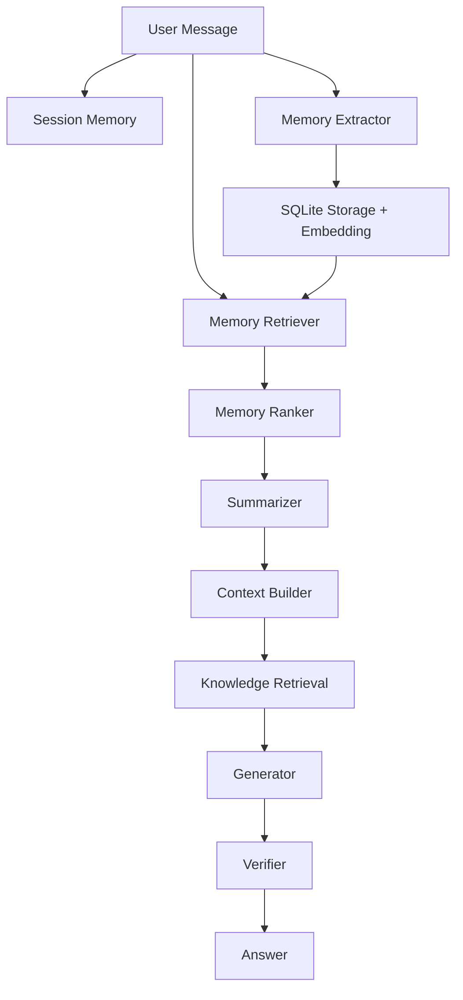

# Phase 6 — Conversation Memory Architecture

## Overview

Phase 6 adds a **modular Conversation Memory & User Context Engine** on top of the
existing Fitness KB RAG stack (Phases 1–5.75). The memory layer is optional and
backward-compatible: existing pipelines continue to work unchanged.

## Components

| Module | Responsibility |
|--------|----------------|
| `memory/extractor.py` | Regex/heuristic fact extraction (no LLM) |
| `memory/storage.py` | SQLite persistence + embedding blobs |
| `memory/retriever.py` | Semantic search + category filtering |
| `memory/ranker.py` | Weighted scoring (similarity, recency, importance) |
| `memory/summarizer.py` | Conversation summary (goal, progress, facts, changes) |
| `memory/context_builder.py` | Formatted LLM context assembly |
| `memory/manager.py` | Orchestration API |
| `conversation/session.py` | Short-term session memory |
| `integration/pipeline_with_memory.py` | Optional RAG bridge |

## Memory Types

### Short-term (session)

- Lives in `ConversationSession` for the active chat
- Examples: `morning_workout=True`, `last_workout=bench`
- Cleared when session ends or user is reset

### Long-term (SQLite)

- Durable user profile facts with embeddings
- Categories: `goal`, `experience`, `height`, `weight`, `age`, `injury`,
  `equipment`, `favorite_exercise`, `workout_split`, `schedule`, `supplement`,
  `diet`, `restriction`, `achievement`

## Pipeline Flow



Integration entry point: `integration.pipeline_with_memory.chat_with_memory()`.

## Ranking Formula

```
score = 0.5 × similarity + 0.3 × recency + 0.2 × importance
```

- **Similarity**: cosine similarity between query and memory embeddings
- **Recency**: exponential decay with 30-day half-life
- **Importance**: per-category default (injuries/restrictions ranked higher)

## Embeddings

Memory uses the **same embedding provider family** as the Knowledge Base
(`retrieval.embeddings`). Tests and CI default to deterministic `hash` embeddings;
production should align `config/memory.yaml` with `config/retrieval.yaml`.

## Configuration

`config/memory.yaml` controls DB path, embedding provider, top-k, ranking weights,
and summarization thresholds.

## Testing & Evaluation

- Unit tests: `tests/test_memory.py` (target ≥90% coverage on `memory/`)
- Benchmark: `evaluation/memory_questions.json` (135 questions)
- Eval script: `evaluation/evaluate_memory.py`

## Design Principles

- **Modular**: each concern in its own file with typed interfaces
- **No LLM for extraction/summary**: regex + heuristics for predictability
- **Production-ready**: SQLite, logging, config-driven weights
- **Backward-compatible**: no changes to Phase 1–5.75 modules
