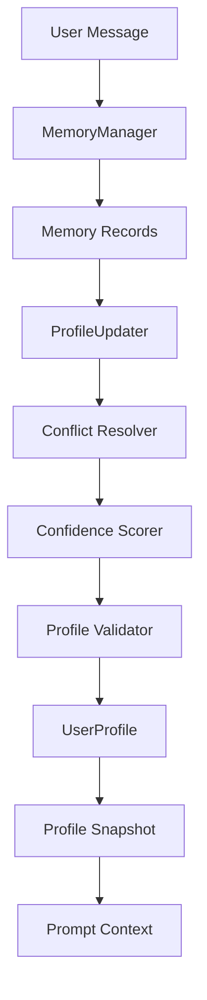

## Phase 6.5 Overview

Phase 6.5 adds a **User Profile Engine** on top of the Phase 6 Memory System.
It aggregates durable user memories into a compact, structured profile that is
stable, conflict-aware, confidence-scored, and optimized for prompt usage.

## Architecture

`UserProfileEngine` is the entry point and depends on:

- `profile/updater.py`: converts memory records into profile fields
- `profile/resolver.py`: resolves conflicts using deterministic rules
- `profile/confidence.py`: computes per-attribute confidence
- `profile/validator.py`: validates profile consistency
- `profile/snapshot.py`: renders compact prompt snapshots
- `memory/manager.py`: provides the underlying memory stream

## Data Flow

## Conflict Resolution

When multiple memories map to the same profile attribute:

1. newer memory wins
2. higher confidence wins
3. explicit statement beats inferred
4. verified memory beats inferred/unverified

## Prompt Priority

Phase 6.5 changes the retrieval order for the new integration wrapper:

1. User Profile snapshot
2. Relevant memories
3. Conversation summary
4. Knowledge retrieval

This reduces context size while preserving the most stable user facts.

## Versioning

Every successful profile-changing update increments `profile.version` and is
recorded as `v1`, `v2`, `v3`, ... through `UserProfileEngine.version_history()`.

## Import / Export

- `save_profile(user_id, path)` writes compact `profile.json`
- `load_profile(user_id, path)` restores compact profile values

## Backward Compatibility

Phase 1–6 remain unchanged. Profile support is exposed through new modules:

- `profile/`
- `integration/pipeline_with_profile.py`

Existing memory and RAG flows continue to work without the profile engine.
